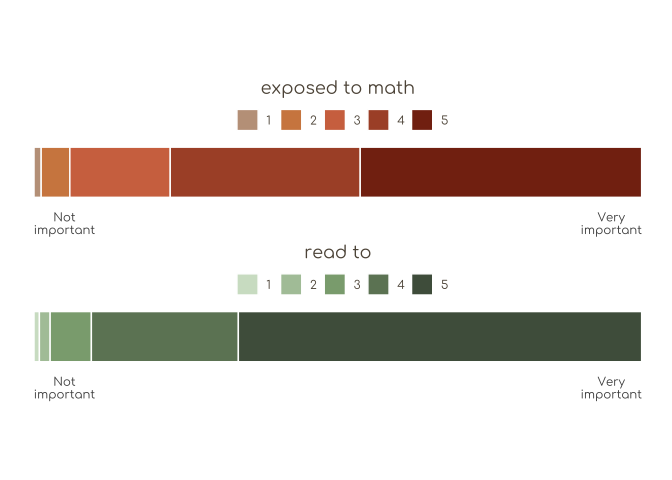
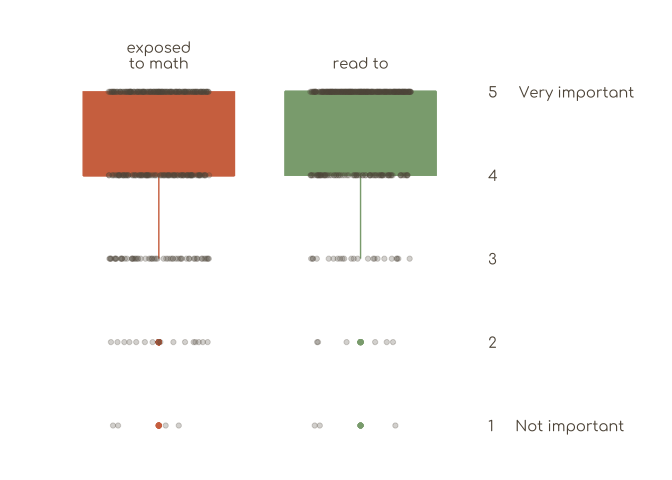
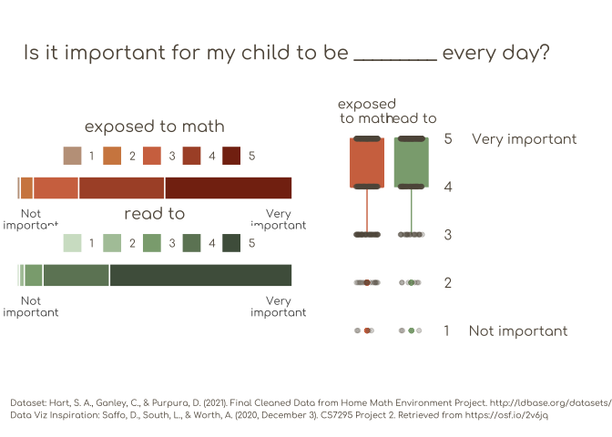

OSO24 - Week 1
================
Christine White
2024-10-07

## Data

Dataset:
<https://ldbase.org/datasets/28729a95-d898-4271-b16e-dc67be8d8689>

**Citation**: Hart, S. A., Ganley, C., & Purpura, D. (2021). Final
Cleaned Data from Home Math Environment Project.
<http://ldbase.org/datasets/28729a95-d898-4271-b16e-dc67be8d8689>

**Data Viz Inspiration**: Saffo, D., South, L., & Worth, A. (2020,
December 3). CS7295 Project 2. Retrieved from <https://osf.io/2v6jq>

## Libraries

``` r
library(here) # here()
library(tidyverse) # tidy
library(ggplot2) # ggplot()
library(showtext) # font_add_google(), showtext_auto()
library(stringr) # str_wrap()
library(ggpubr) # ggarrange()
library(grid) # grobTree()
```

## Data Cleaning

``` r
# Read in data 
dat0 <- read.csv(here("OSO-Data/FinalCleanedData.csv"),
                 na.strings = ".") # Convert . to NA for missing data

# Clean one data entry error in math variable
clean_dat <- dat0 |> select(id, matheveryday, 
                          readtoeveryday) |> 
  mutate(matheveryday = case_when(matheveryday == 0 ~ 1,
                         TRUE ~ matheveryday))
```

## Font Import

``` r
# Import font from Google Fonts
font_add_google("Comfortaa", "comf")

# Activate font for subsequent plots
showtext_auto()
```

## Plot 1: Proportion Plot

``` r
### Math -----------------------------------------------------------------------
## Create and format summary data for plotting
plot1a_dat <- clean_dat |> group_by(matheveryday) |>
  rename(rating = matheveryday) |>
  summarise(pct = n()/339) |> 
  mutate(item = "math")

## Create plot 
plot1a <- ggplot(plot1a_dat, aes(x = "", y = pct)) + 
  geom_col(aes(fill = fct_rev(factor(rating))), color = "white")  + 
  coord_flip() + ggtitle("exposed to math") +
  guides(fill = guide_legend(reverse = TRUE)) +
  theme(legend.position = "top",
        legend.box.spacing = unit(0, "pt"),
        axis.text.y = element_blank(),
        axis.title = element_blank(),
        axis.ticks = element_blank(), 
        text = element_text(color = "#5f5547",
                            family = "comf", size = 11),
        plot.title = element_text(hjust = .5),
        plot.background = element_rect(fill = "white"),
        panel.background = element_rect(fill= "white"),
        plot.margin = margin(c(0,0,-2,0),unit="cm"),
        aspect.ratio = .1) + 
  scale_fill_manual("", values = rev(c("#C1A089", "#d1884f", "#d1734f", "#ac5132", "#842d13"))) + 
  scale_y_continuous(breaks = c(.05, .95),
                     labels = c(str_wrap("Not important", 4), 
                                str_wrap("Very important", 4)))

### Reading --------------------------------------------------------------------
## Create and format summary data for plotting
plot1b_dat <- clean_dat |> group_by(readtoeveryday) |>
  rename(rating = readtoeveryday) |>
  summarise(pct = n()/339) |> 
  mutate(item = "read")

plot1b <- ggplot(plot1b_dat, aes(x = "", y = pct)) + 
  geom_col(aes(fill = fct_rev(factor(rating))), color = "white")  + 
  coord_flip() + ggtitle("read to") +
guides(fill = guide_legend(reverse = TRUE)) +
  theme(legend.position = "top",
        legend.box.spacing = unit(0, "pt"),
        axis.text.y = element_blank(),
        axis.title = element_blank(),
        axis.ticks = element_blank(),
        text = element_text(color = "#5f5547", family = "comf", size = 11), 
        plot.title = element_text(hjust = .5),
        plot.margin = margin(c(-2,0,0,0), unit = "cm"),
        plot.background = element_rect(fill = "white"),
        panel.background = element_rect(fill= "white"),
        aspect.ratio = .1) + 
  scale_fill_manual("", values = rev(c("#d1e1cb", "#afc6a7", "#8ba97f", "#6d8465", "#4f5e4a"))) + 
  scale_y_continuous(breaks = c(.05, .95),
                     labels = c(str_wrap("Not important", 4), 
                                str_wrap("Very important", 4)))

### Combine --------------------------------------------------------------------
plot1 <- ggarrange(plot1a, plot1b, ncol = 1)

### Print ----------------------------------------------------------------------
plot1
```

<!-- -->

## Plot 2: Boxplots

``` r
### Create and format summary data for plotting --------------------------------
plot2_dat <- clean_dat |> # Pivot to long format
  pivot_longer(matheveryday:readtoeveryday,
               names_to = "item", values_to = "value")

### Create plot ----------------------------------------------------------------
plot2 <- plot2_dat |> ggplot() + 
  geom_boxplot(aes(y = value, x = item, fill = item, color = item)) +
  geom_point(aes(y = value, x = item), # Add points
             color = "#5f5547", alpha = .25,
             position = position_dodge2(width = .5)) +
  theme(axis.title = element_blank(),
        axis.ticks = element_blank(),
        axis.text = element_text(color = "#5f5547", 
                                   size = 11, family = "comf"),
        legend.position = "none",
        plot.background = element_rect(fill = "white"),
        panel.background = element_rect(fill= "white"),
        panel.grid = element_blank(),
        plot.margin = margin(c(1,1,1,1),unit="cm"),) +
  scale_fill_manual(values = c("#d1734f", "#8BA97F")) +
  scale_color_manual(values = c("#d1734f", "#8BA97F")) +
  scale_y_continuous(breaks = c(1:5),
                     labels = c("1     Not important",
                              "2", "3", "4",
                              "5     Very important"),
                     position = "right") + 
  scale_x_discrete(labels = c(str_wrap("exposed to math", 7),
                              "read to"),
                   position = "top")

### Print ----------------------------------------------------------------------
plot2
```

<!-- -->

## Finalizing Plot

``` r
### Combine Plots 1 and 2 ------------------------------------------------------
plot1_2 <- ggarrange(plot1, plot2)

### Title Text Grob ------------------------------------------------------------
titletext <- grobTree(textGrob("Is it important for my child to be _________ every day?", x = unit(1, "lines"), y = unit(0, "lines"),
                               hjust = 0, vjust = -0.2,
                               gp=gpar(fontsize=16, col="#5f5547", 
                                       fontfamily = "comf")))

### Well Text Grob -------------------------------------------------------------
welltext <- grobTree(textGrob("Dataset: Hart, S. A., Ganley, C., & Purpura, D. (2021). Final Cleaned Data from Home Math Environment Project. http://ldbase.org/datasets/28729a95-d898-4271-b16e-dc67be8d8689 \nData Viz Inspiration: Saffo, D., South, L., & Worth, A. (2020, December 3). CS7295 Project 2. Retrieved from https://osf.io/2v6jq",
                              x = unit(1, "lines"), y = unit(0, "lines"),
                              hjust = 0, vjust = -1,
                              gp=gpar(fontsize=7, col="#5f5547",
                                      fontfamily="comf")))
### Combine all ----------------------------------------------------------------
final_plot <- ggarrange(titletext, plot1_2, welltext, 
                  ncol = 1, heights = c(.2, 1, .2))

final_plot
```

<!-- -->

## Saving Plot

``` r
ggsave(here("Plot/OSOctober-Week1-Plot.pdf"),
       final_plot, height = 6, width = 10,
       units = "in")
```
