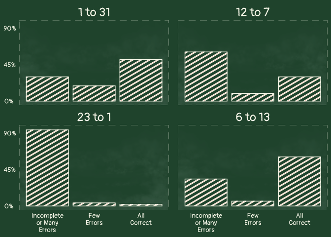

OSO24-Week2
================
Christine White
2024-10-14

## Data

**Dataset**:
<https://ldbase.org/projects/6238a896-f1cc-4cf9-9c52-b23fede10747>

**Citation**: Fuchs, L. S., Hamlett, C. L., Fuchs, D., Cho, E., Barnes,
M. A., Koponen, T., & Espinas, D. R. (2023). Comorbid Word Reading and
Math Computation Difficulty at Start of First Grade.
<https://doi.org/10.33009/ldbase.1691262928.78d5>

## Libraries

``` r
library(here) # here()
```

    ## here() starts at /Users/christinewhite/Library/CloudStorage/OneDrive-FloridaStateUniversity/New/School/6_LDbase/OSO Git/OSO-2024-Contributions

``` r
library(readxl) # read_excel() 
library(tidyverse)
```

    ## ── Attaching core tidyverse packages ──────────────────────── tidyverse 2.0.0 ──
    ## ✔ dplyr     1.1.4     ✔ readr     2.1.5
    ## ✔ forcats   1.0.0     ✔ stringr   1.5.1
    ## ✔ ggplot2   3.5.1     ✔ tibble    3.2.1
    ## ✔ lubridate 1.9.3     ✔ tidyr     1.3.1
    ## ✔ purrr     1.0.2

    ## ── Conflicts ────────────────────────────────────────── tidyverse_conflicts() ──
    ## ✖ dplyr::filter() masks stats::filter()
    ## ✖ dplyr::lag()    masks stats::lag()
    ## ℹ Use the conflicted package (<http://conflicted.r-lib.org/>) to force all conflicts to become errors

``` r
library(stringr) # str_wrap()
library(showtext) # font_add_google(), showtext_auto()
```

    ## Loading required package: sysfonts
    ## Loading required package: showtextdb

``` r
library(grid) # grob
library(ggpubr) # ggarrange()
library(ggpattern) # geom_col_pattern()
```

## Data Wrangling

``` r
dat0 <- read_excel(here("OSO-Data/Comorbid Word Reading and Math Computation Difficulty at Start of First Grade.xlsx"))

# Pivot to long format and create new variables for plot labels
dat1 <- dat0 |> select(STID, AGE, contains("prNUMSEQT")) |>
  pivot_longer(prNUMSEQT1:prNUMSEQT4, 
               names_to = "TASK",
               values_to = "SCORE") |>
  mutate(NUMSEQ = recode(TASK, 
                     "prNUMSEQT1" = "1 to 31",
                     "prNUMSEQT2" = "6 to 13",
                     "prNUMSEQT3" = "12 to 7",
                     "prNUMSEQT4" = "23 to 1"))

# Summarize to get proportion of each score by sequence
dat2 <- dat1 |> group_by(NUMSEQ) |>
  summarise(n = n(),
            prop2 = sum(SCORE==2)/n,
            prop1 = sum(SCORE==1)/n,
            prop0 = sum(SCORE==0)/n,
            propsum = prop2+prop1+prop0) |>
  pivot_longer(prop2:prop0,
               names_to = "Score", values_to = "Proportion") |>
  mutate(Score = substr(Score, 5, 5))
```

## Creating Main Plot

``` r
# Import font from Google Fonts
font_add_google("Pangolin", "pang")

# Activate font for subsequent plots
showtext_auto()

# Read in chalkboard dust image (saved in directory)
image <- png::readPNG(here("OSO24-Week-2/Chalk.png"))

# Create plot
plot1 <- ggplot(dat2, aes(x=as.numeric(Score), 
                 y = Proportion)) + 
    background_image(image) +
  geom_col_pattern(aes(pattern_fill = "stripe"),
                       pattern_color =  "#fafaee",
                   color = "#fafaee", fill = "#28533A") +
  facet_wrap(~fct_inorder(factor(NUMSEQ)), ncol = 2) + 
  scale_x_continuous(breaks = c(0, 1, 2),
                     labels = c(str_wrap("Incomplete or Many Errors", 10),
                                str_wrap("Few Errors", 4),
                                str_wrap("All Correct", 4))) +
  scale_y_continuous(limits = c(0, .95),
                     breaks = c(0, .45, .9),
                     labels = c("0%", "45%", "90%")) +
  theme_minimal() + 
  theme(legend.position = "none",
        panel.grid = element_blank(),
        axis.title = element_blank(),
        panel.background = element_rect(fill = "#28533A", 
                                        color = "#fafaee",
                                        linetype = "dashed",
                                        linewidth = 1),
        plot.background = element_rect(fill = "#28533A", color = "#28533A"),
        text = element_text(family = "pang"),
        axis.text.y = element_text(size = 10, color = "#fafaee",
                                   hjust = .2),
        axis.text.x = element_text(size = 10, color = "#fafaee"),
        strip.text = element_text(size = 18, color = "#fafaee"),
        panel.spacing.x=unit(1, "lines"))

plot1
```

<!-- -->

## Creating Title and Well Text Grobs

``` r
# Title Text
titletext <- grobTree(rectGrob(gp=gpar(fill="#28533A",  color = "#28533A",lwd = 0)), 
                      textGrob("Counting forwards is a TREAT - backwards is TRICKIER!", 
                               x = unit(1, "lines"), y = unit(1.01, "lines"),
                               hjust = 0, vjust = .5,
                               gp=gpar(fontsize=18, col="#fafaee", lwd = 0,
                                       fontfamily = "pang")))


# Subtitle Text
subtitletext <- grobTree(rectGrob(gp=gpar(fill="#28533A", color = "#28533A", lwd = 0)), 
                      textGrob("234 1st graders were tasked with counting the following sequences. These plots show the percentage of\n students scoring at each accuracy level.", 
                               x = unit(1.5, "lines"), y = unit(1, "lines"),
                               hjust = 0, vjust = 0,
                               gp=gpar(fontsize=11, col="#fafaee", lwd = 0,
                                       fontfamily = "pang")))

# Well Text
welltext <- grobTree(rectGrob(gp=gpar(fill="#28533A", color = "#28533A", lwd = 0)), 
                      textGrob("Dataset: Fuchs, L. S., Hamlett, C. L., Fuchs, D., Cho, E., Barnes, M. A., Koponen, T., & Espinas, D. R. (2023). Comorbid Word Reading and Math \nComputation Difficulty at Start of First Grade. https://doi.org/10.33009/ldbase.1691262928.78d5", 
                               x = unit(1, "lines"), y = unit(1, "lines"),
                               hjust = 0, vjust = 0,
                               gp=gpar(fontsize=8, col="#fafaee", lwd = 0,
                                       fontfamily = "pang")))
```

## Putting it all together

``` r
# Arrange plots in 1 column
plot3 <- ggarrange(titletext, subtitletext, plot1, welltext, 
                            ncol = 1,
          heights = c(.15, .15, 1, .2))

# Save as PDF
ggsave(here("OSO24-Week-2/OSO-Week2-Plot.pdf"), plot3,
       units = "in", height = 5, width = 8)
```
