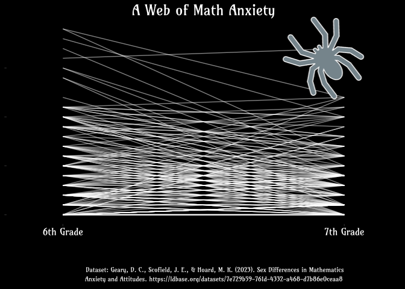

OSO24-Week-3
================
Christine White
2024-10-23

## Data

**Dataset**:
<https://ldbase.org/datasets/7e729b59-761d-4332-a468-d7b86e0ceaa8>

**Citation**: Geary, D. C., Scofield, J. E., & Hoard, M. K. (2023). Sex
Differences in Mathematics Anxiety and Attitudes.
<https://doi.org/10.1037/edu0000355>

## Libraries

``` r
library(here) # here()
library(tidyverse)
library(showtext) # font_add_google(), showtext_auto()
library(grid)
library(ggpubr)
library(cowplot)
```

## Data Import & Prep

``` r
dat7th <- read.table(here("OSO-Data/MathAnxSeventh.csv")) # Read in data file for 7th grade

colnames(dat7th) <- c("ID", "Sex", "MathStan_6s", # Rename columns based on codebook
                      "EAttMn_6", "MAttMn_6", "MAnxEval_6", 
                      "MAnxLearn_6", "NO_SS_7", "EAttMn_7", "MAttMn_7", 
                      "MAnxEval_6_dup", "MAnxLearn_7", "IQ_7", "WR_SS_7", "JLAP_7")

# Create data subset in long format for plot
plotdf <- dat7th |> select(ID, contains("MAnxLearn")) |>
  pivot_longer(MAnxLearn_6:MAnxLearn_7, names_to = "Grade", values_to = "Score")
```

## Plot

``` r
# Import font from Google Fonts
font_add_google("Amarante", "ama")

# Activate font for subsequent plots
showtext_auto()

# Import spider image 
spider <- png::readPNG(here("OSO24-Week-3/Spider.png"))

plot <- ggplot(plotdf) + 
  geom_line(aes(x=Grade, y = Score, group = ID), color = "white", alpha = .5) +
  ggtitle("A Web of Math Anxiety") +
  theme(plot.background = element_rect(fill = "black", color = "black"),
        panel.background = element_rect(fill = "black", color = "black"),
        panel.grid = element_blank(),
        axis.title = element_blank(),
        axis.text.x = element_text(color = "white", family = "ama", size = 12),
        axis.text.y = element_blank(),
        plot.title = element_text(color = "white", hjust = .5,
                                  family = "ama", size = 18)) + 
  scale_x_discrete(expand = c(0.2, 0),
                   labels = c("6th Grade", "7th Grade"))


welltext <- grobTree(rectGrob(gp=gpar(fill="black", color = "black", lwd = 0)), 
                      textGrob("Dataset: Geary, D. C., Scofield, J. E., & Hoard, M. K. (2023). Sex Differences in Mathematics \nAnxiety and Attitudes. https://ldbase.org/datasets/7e729b59-761d-4332-a468-d7b86e0ceaa8", 
                               x = unit(1, "lines"), y = unit(1, "lines"),
                               hjust = -.3, vjust = 0,
                               gp=gpar(fontsize=8, col="white", lwd = 0,
                                       fontfamily = "ama")))

plot2 <- ggarrange(plot, welltext,
          ncol = 1, heights = c(1, .2))

plot2 + draw_image(spider, width = .4, height = .4,
                   y = .6, x = .6)
```

<!-- -->
